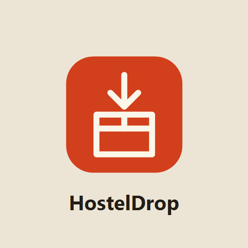

<p align="center">
  
</p>

<h1 align="center">HostelDrop</h1>

<p align="center">
  A full-stack intra-hostel parcel management system for students, reception guards, and administrators.
</p>

<p align="center">
  
  
  
  
  
</p>

## Overview

HostelDrop digitizes parcel intake, assignment, notification, pickup, and delivery tracking inside a hostel. Guards can log incoming parcels, assign them to students or rooms, verify pickup with short-lived QR tokens, and review delivered parcels. Students can register, sign in, view parcel updates, receive notifications, request room changes, and delegate pickup. Admins can manage users, room transfers, room change requests, and delivered-parcel maintenance.

## Key Features

- Role-based flows for students, guards, and admins.
- Student registration with email OTP verification and password-based login.
- Password reset via email OTP.
- Guard dashboard for parcel intake, assignment, update, search, QR pickup, and delivery tracking.
- Short-lived QR pickup tokens with single-use validation.
- Delegated pickup support with authenticated receiver tracking.
- Student dashboards for all hostel parcels, personal parcels, profile, notifications, and room changes.
- Admin tools for user management, room transfer, room history, and delivered-parcel cleanup.
- Gmail SMTP app-password support for OTP and parcel notification emails.
- Expo push notification support.
- Backend security guardrails for JWT secrets, password strength, CORS, rate limits, input validation, and response headers.
- Pytest, Locust, and k6 coverage for security checks and backend load validation.

## Tech Stack

| Layer | Tools |
| --- | --- |
| Mobile app | Expo, React Native, Expo Router, TypeScript, Zustand |
| Backend API | FastAPI, Pydantic, Uvicorn |
| Database | MongoDB with Motor async driver |
| Auth | JWT bearer tokens, passlib bcrypt |
| Notifications | Gmail SMTP, Expo push notifications |
| Testing | Pytest, Locust, k6 |

## User Roles

| Role | Capabilities |
| --- | --- |
| Student | Register, log in, view parcels, receive notifications, scan QR pickup, delegate pickup, request room changes |
| Guard | Add parcels, assign parcels, search parcels, generate QR, verify pickup, view delivered parcels |
| Admin | Add users, manage students and guards, approve room changes, transfer rooms, inspect room history, clean delivered records |

## Repository Structure

```text
.
|-- backend/                 # FastAPI application
|   |-- server.py            # Entrypoint: middleware, lifespan, router registration
|   |-- core/                # config, db, models, validators, security, services, domain
|   `-- routers/             # auth, students, admin, parcels route modules
|-- frontend/                # Expo Router React Native app
|-- tests/                   # Pytest backend security and guardrail tests
|-- stress-tests/            # k6 and Locust stress-test scripts plus result artifacts
|-- document/                # Project documentation
|-- logo/                    # README and project logo assets
|-- populate_display_ids.py  # Utility script for parcel display IDs
|-- pyrightconfig.json       # Python type-checking configuration
`-- README.md
```

## Prerequisites

- Python 3.11 or newer
- Node.js 20.x or 22.x
- MongoDB running locally or a reachable MongoDB connection string
- Expo development environment for Android, iOS, or web
- Optional: k6 and Locust for load testing

## Local Setup

Clone the repository:

```bash
git clone <your-repository-url>
cd HostelDrop-IntraHostel_Parcel_Management_System
```

Create local environment files:

```bash
cp backend/.env.example backend/.env
cp frontend/.env.example frontend/.env
```

On Windows PowerShell:

```powershell
Copy-Item backend\.env.example backend\.env
Copy-Item frontend\.env.example frontend\.env
```

Update `backend/.env` with your MongoDB URL, JWT secret, admin password, and optional SMTP credentials. Update `frontend/.env` if your backend is not available at `http://localhost:8001`.

## Run The Backend

From the repository root:

```bash
python -m venv .venv
source .venv/bin/activate
pip install -r backend/requirements.txt
python -m uvicorn backend.server:app --host 0.0.0.0 --port 8001 --reload
```

On Windows PowerShell:

```powershell
python -m venv .venv
.\.venv\Scripts\Activate.ps1
pip install -r backend\requirements.txt
python -m uvicorn backend.server:app --host 0.0.0.0 --port 8001 --reload
```

Backend URLs:

- API root: `http://localhost:8001/api`
- Swagger docs: `http://localhost:8001/docs`

Students self-register from the app, and guards are created by an admin from the
admin panel, so no database seeding step is required.

## Run The Frontend

From the `frontend` directory:

```bash
npm install
npx expo start -c
```

Use the Expo CLI options to open the app on Android, iOS, Expo Go, or web.

For physical-device testing, expose the backend and set `EXPO_PUBLIC_BACKEND_URL` to the tunnel URL:

```bash
npx cloudflared tunnel --url http://localhost:8001
```

## Environment Variables

Backend variables are defined in [`backend/.env.example`](backend/.env.example).

| Variable | Purpose |
| --- | --- |
| `APP_ENV` | Runtime environment, use `production` in deployments |
| `MONGO_URL` | MongoDB connection string |
| `DB_NAME` | MongoDB database name |
| `JWT_SECRET_KEY` | JWT signing secret |
| `ADMIN_EMAIL` / `ADMIN_PASSWORD` | Admin login credentials |
| `CORS_ORIGINS` | Allowed frontend origins |
| `SMTP_EMAIL` / `SMTP_APP_PASSWORD` | Gmail SMTP credentials |
| `INCLUDE_DEBUG_OTP_IN_RESPONSE` | Development-only OTP debugging switch |

Frontend variables are defined in [`frontend/.env.example`](frontend/.env.example).

| Variable | Purpose |
| --- | --- |
| `EXPO_PUBLIC_BACKEND_URL` | Backend host used by the mobile app |
| `EXPO_PUBLIC_FEEDBACK_FORM_URL` | Public Google Form response link opened by the app feedback button |

Never commit real `.env` files or production secrets.

## Feedback Form Setup

The app shows a feedback button on the notice board and role-selection screens. To collect responses privately in your Google account:

1. Create a Google Form with these questions: `Name`, `Roll number (optional)`, `Problem you are facing`, and `Suggestion, if any (optional)`.
2. Keep the form responses private to your Google account and do not share the edit link.
3. Copy the public responder link from the form's Send option.
4. Add it to `frontend/.env` as `EXPO_PUBLIC_FEEDBACK_FORM_URL`.

## Email Setup

HostelDrop uses Gmail SMTP app passwords for OTP and parcel notification emails.

1. Enable 2-step verification on the Gmail account.
2. Create an app password from Google Account security settings.
3. Add the values to `backend/.env`:

```env
SMTP_EMAIL=your-email@gmail.com
SMTP_APP_PASSWORD=your-16-character-app-password
```

When SMTP is not configured in development, the backend logs OTP activity instead of failing the request. Keep sensitive logging disabled outside local development.

## Pickup Workflows

| Workflow | Summary |
| --- | --- |
| QR pickup | Guard generates a short-lived QR token, student scans it from an authenticated app session, and the backend validates ownership before delivery |
| Delegated pickup | Student delegates pickup to another registered student, and the backend records the delegated receiver after QR validation |

## API Areas

| Area | Main endpoints |
| --- | --- |
| Auth | `/api/auth/guard/login`, `/api/auth/admin/login`, `/api/auth/student/login`, `/api/auth/student/register/*` |
| Student | `/api/student/room-change-request`, `/api/student/notifications`, `/api/auth/student/profile` |
| Admin | `/api/admin/users`, `/api/admin/add-user`, `/api/admin/room-change-requests`, `/api/admin/student/room-history` |
| Parcels | `/api/parcel/add`, `/api/parcel/assign`, `/api/parcel/update`, `/api/parcel/hostel/{type}` |
| QR pickup | `/api/parcel/generate-qr`, `/api/parcel/delegate`, `/api/parcel/verify-qr` |

## Testing

Run backend tests:

```bash
pytest
```

Run frontend linting:

```bash
cd frontend
npm run lint
```

Run k6 scenarios from the repository root:

```bash
k6 run stress-tests/k6/load-ramp.js
k6 run stress-tests/k6/spike.js
k6 run stress-tests/k6/soak.js
k6 run stress-tests/k6/breakpoint.js
k6 run stress-tests/k6/input-growth.js
```

Run Locust:

```bash
python -m locust -f stress-tests/locustfile.py --host http://localhost:8001
```

Stress-test environment variables:

```bash
BASE_URL=http://localhost:8001
HOSTEL_TYPE=BOYS
GUARD_USERNAME=<guard_username>
GUARD_PASSWORD=<guard_password>
```

## Maintenance

Frontend dependency checks:

```bash
cd frontend
npm run deps:doctor
npm run deps:outdated
npm run maintenance:android
```

Security checklist before publishing or deploying:

- Keep `APP_ENV=production` in deployed environments.
- Use a strong `JWT_SECRET_KEY` and admin password.
- Keep `INCLUDE_DEBUG_OTP_IN_RESPONSE=false` outside local development.
- Store secrets in deployment secret managers or CI/CD variables.
- Verify that no `.env` files are tracked.

## License

Copyright (c) 2026 HostelDrop contributors.

All rights reserved. This project is provided for academic and portfolio review purposes only. No permission is granted to copy, modify, distribute, sublicense, or use this software without explicit written permission from the owner.
