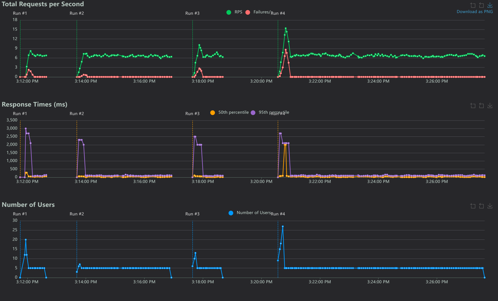
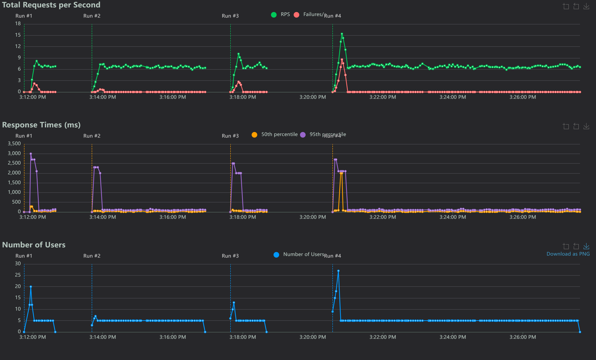
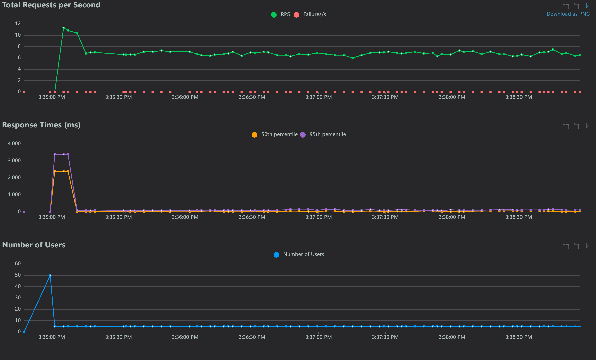
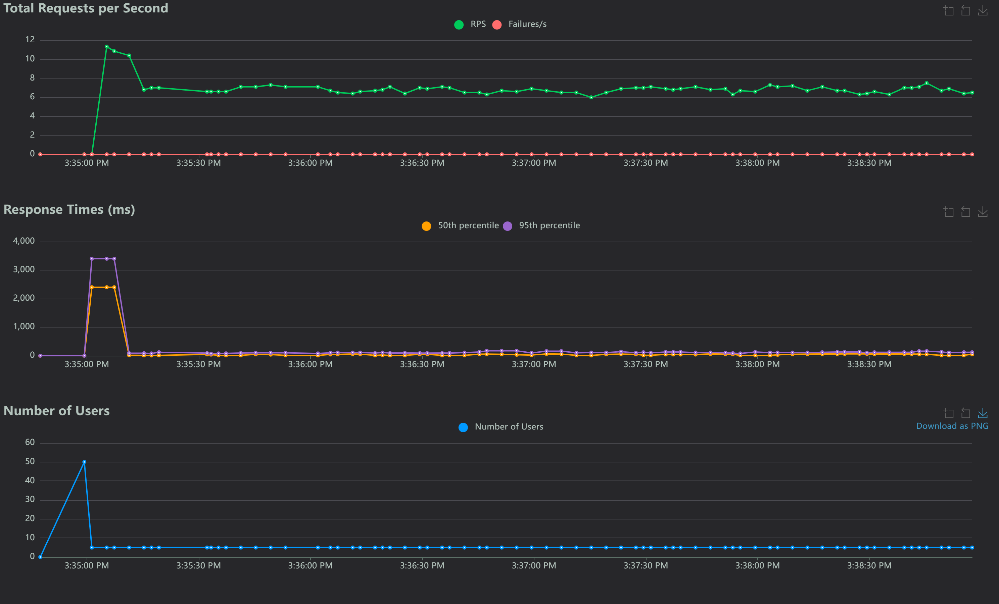

# Comprehensive Stress Testing Documentation

## 1. Document Control
- Project: HostelDrop Intra-Hostel Parcel Management System
- System Under Test: Backend API at http://localhost:8001
- Test Date: 2026-04-10
- Environment: Local Windows setup
- Toolset:
  - Grafana k6 scenario suite
  - Locust mixed user-journey suite
- Scope: Consolidated report for previous k6 testing and latest Locust runs

## 2. Test Objectives
This document consolidates two categories of load and stress validation.

1. Grafana k6 suite
- Validate backend performance under ramp, spike, soak, breakpoint, and input-growth workloads.

2. Locust suite
- Validate realistic mixed guard workflow behavior in:
  - performance mode
  - rate-limit guardrail mode

## 3. Shared Test Configuration
- Base URL: http://localhost:8001
- Hostel type: BOYS
- Guard username: guard
- Guard password: guard123

## 4. Source Artifacts

### 4.1 k6 Scripts and Prior Report
- stress-tests/k6/load-ramp.js
- stress-tests/k6/spike.js
- stress-tests/k6/soak.js
- stress-tests/k6/breakpoint.js
- stress-tests/k6/input-growth.js
- stress-tests/STRESS_TEST_REPORT.md

### 4.2 Locust Performance Run
- stress-tests/performance_test/Locust_2026-04-10-15h20_locustfile.py_http___localhost_8001_requests.csv
- stress-tests/performance_test/Locust_2026-04-10-15h20_locustfile.py_http___localhost_8001_failures.csv
- stress-tests/performance_test/Locust_2026-04-10-15h20_locustfile.py_http___localhost_8001_exceptions.csv
- stress-tests/performance_test/Locust_2026-04-10-15h20_locustfile.py_http___localhost_8001.html

### 4.3 Locust Rate-Limit Run
- stress-tests/RateLimitTest/Locust_2026-04-10-15h34_locustfile.py_http___localhost_8001_requests.csv
- stress-tests/RateLimitTest/Locust_2026-04-10-15h34_locustfile.py_http___localhost_8001_failures.csv
- stress-tests/RateLimitTest/Locust_2026-04-10-15h34_locustfile.py_http___localhost_8001_exceptions.csv
- stress-tests/RateLimitTest/Locust_2026-04-10-15h34_locustfile.py_http___localhost_8001.html

## 5. Previous Grafana k6 Results (Included)
The following section consolidates the previously executed k6 results from stress-tests/STRESS_TEST_REPORT.md.

### 5.1 Ramp Load Test
- Script: stress-tests/k6/load-ramp.js
- Max VUs: 100
- Duration: 6 minutes (+ graceful stop)
- p95 latency: 103.88 ms
- p99 latency: 149.43 ms
- Error rate: 0.00%
- Requests: 31,573
- Status: PASS

### 5.2 Spike Test
- Script: stress-tests/k6/spike.js
- Max VUs: 200
- Duration: 3.5 minutes (+ graceful stop)
- p95 latency: 793.61 ms
- Average latency: 406.17 ms
- Error rate: 0.00%
- Requests: 27,905
- Status: PASS

### 5.3 Soak Test
- Script: stress-tests/k6/soak.js
- Constant VUs: 40
- Duration: 60 minutes
- p95 latency: 17.64 ms
- Average latency: 10.31 ms
- Error rate: 0.00%
- Requests: 142,476
- Status: PASS

### 5.4 Breakpoint Test
- Script: stress-tests/k6/breakpoint.js
- Max VUs: 300
- Duration: 7 minutes (+ graceful stop)
- p95 latency: 1.00 s
- Average latency: 296.88 ms
- Error rate: 0.00%
- Requests: 99,147
- Status: PASS

### 5.5 Input Growth Test
- Script: stress-tests/k6/input-growth.js
- VUs: 12
- Iterations: 180
- Payload sizes: 32,128,256,512,1024,2048,4096
- Final run p95 latency: 28.79 ms
- Final run average latency: 11.90 ms
- Final run error rate: 0.00%
- Requests: 181
- Status: PASS

### 5.6 k6 Interpretation
The prior k6 campaign indicates stable backend behavior under progressive, burst, sustained, and boundary load scenarios. After correcting expected-status handling in input-growth, all k6 scenarios passed.

## 6. Locust Performance Mode Results

### 6.1 Summary
- Total requests: 2934
- Total failures: 93
- Overall failure rate: 3.17%
- Aggregated average response time: 107.76 ms
- Aggregated p95: 130 ms

### 6.2 Endpoint Observations
- auth_guard_login
  - Requests: 98
  - Failures: 93
  - Primary error: 429 Too many requests
  - Average latency: 2081.49 ms
- guard_pending
  - Requests: 1295
  - Failures: 0
  - Average latency: 71.85 ms
- guard_delivered
  - Requests: 883
  - Failures: 0
  - Average latency: 12.94 ms
- parcel_add_small
  - Requests: 437
  - Failures: 0
  - Average latency: 11.69 ms
- parcel_add_large
  - Requests: 221
  - Failures: 0
  - Average latency: 11.75 ms

### 6.3 Interpretation
Workflow endpoints were stable and error-free. Failures were isolated to login throttling under startup pressure.

### 6.4 Charts
#### Total Requests per Second (Performance)

#### Response Times (Performance)
_1775815099.592.png)

#### Number of Users (Performance)

## 7. Locust Rate-Limit Mode Results

### 7.1 Summary
- Total requests: 1655
- Total failures: 0
- Overall failure rate: 0.00%
- Aggregated average response time: 130.02 ms
- Aggregated p95: 140 ms

### 7.2 Endpoint Observations
- auth_guard_login
  - Requests: 50
  - Failures: 0
  - Median latency: 2400 ms
  - Average latency: 2879.24 ms
- guard_pending
  - Requests: 750
  - Failures: 0
  - Average latency: 78.29 ms
- guard_delivered
  - Requests: 517
  - Failures: 0
  - Average latency: 14.22 ms
- parcel_add_small
  - Requests: 228
  - Failures: 0
  - Average latency: 11.89 ms
- parcel_add_large
  - Requests: 110
  - Failures: 0
  - Average latency: 22.16 ms

### 7.3 Interpretation
Rate-limit behavior is controlled and stable. Auth latency rises under throttle pressure while business endpoints remain healthy.

### 7.4 Charts
#### Total Requests per Second (Rate-Limit)

#### Response Times (Rate-Limit)
_1775815795.413.png)

#### Number of Users (Rate-Limit)

## 8. Consolidated Comparison

| Category | k6 Overall | Locust Performance | Locust Rate-Limit |
|---|---|---|---|
| Goal | Capacity and resilience across load shapes | Authenticated workflow behavior | Guardrail enforcement behavior |
| Outcome | PASS across all scenarios | Workflow stable, login throttled | Stable and controlled throttle behavior |
| Errors | 0.00% in final scenario summaries | 3.17% overall, concentrated in login | 0.00% failures |
| Key latency profile | Strong p95 across scenarios | Workflow fast, login slow under throttle | Login slow under throttle, workflow stable |

## 9. Formal Conclusion
1. Previous Grafana k6 testing confirms strong backend resilience under ramp, spike, soak, breakpoint, and input-growth workloads.
2. Current Locust performance testing confirms stable authenticated business workflow endpoints.
3. Current Locust rate-limit testing confirms expected throttling behavior with stable downstream operations.
4. Across both toolchains, there is no evidence of backend crash-level instability in submitted artifacts.

## 10. Recommendations
1. Continue reporting k6 and Locust outcomes separately, then provide a consolidated executive summary.
2. Add k6 summary export files for future chart embedding directly in this document.
3. Add dedicated high-load tests for student and admin critical paths to expand coverage.
4. Maintain fixed environment baselines for trend comparison across releases.
